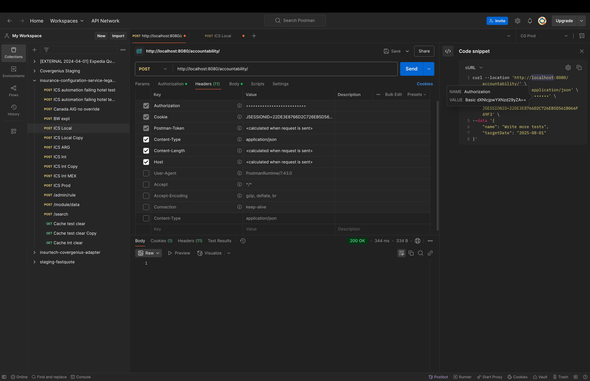

| Term                         | 🔑 Summary                                            |
|------------------------------| ----------------------------------------------------- |
| **Authentication**           | Identifies **who you are** (e.g., login)              |
| **Autho-ri-zation** (rights) | Determines **what you can do** (e.g., access control) |

Spring security:
Provides Basic HTTP authentication
    -  The client sends the username and password in the Authorization header.- Basic <base64(username:password)>

## How Custom Authentication using Repo works
1. 1. Authentication is handled by an `AuthenticationProvider`Interface (e.g., Implementation: `DaoAuthenticationProvider`).
2. The provider uses a `UserDetailsService` to load the user from the database (via repository).
3. If the user exists, `UserDetailsService` returns a `UserDetails` object.
    - This can be Spring’s default `User` class or a custom class implementing `UserDetails`.

🔐 What is CSRF? (Cross-Site Request Forgery)
How Does CSRF Happen?
When a user logs in, the browser stores the session ID in a cookie.

For every request in that session, the browser automatically sends the cookie — regardless of where the request came from.

If a malicious site (in another tab or iframe) tricks the browser into making a request (like a POST), the browser still includes the session cookie.

The server can’t tell if it was you or the malicious site — so the action gets executed as if you did it.

#@RestController("/login") - is this right? No it will not set the path , it will set the bean name of the RestController.
you have to use @RequestMapping("/login") or @PostMapping("/login") to set the path.

Key takeaway
@RestController (or @Controller) does not accept a path; its value is just the bean name.

Always use @RequestMapping, @GetMapping, @PostMapping, etc. for URL paths.

#Annotaions
## @EnableWebSecurity 
-implicitly added when we add spring-security dependency. That is why you don't see it in the code.

Activates Spring Security for your application

Registers the SecurityFilterChain beans

Adds Spring Security’s filters into the servlet filter chain

Allows you to provide custom configuration

You can define your own SecurityFilterChain bean or (in older versions) extend WebSecurityConfigurerAdapter

# Spring Security with JWT

Required dependencies:
jwt-api
jwt-implementaion
jwt-jackson

Why JWT?
In Basic Authentication,
    - the base64 encoded string of username and password is sent with every request.
    - This is not secure as the credentials are sent with every request.( provided only http is used)

In JWT,
    - the user is authenticated once and a token is generated.
    - This token is sent with every request in the Authorization header
    - The server verifies the token and grants access to the user.
    - The token contains all the information about the user. you can add custom claims(more data) to the token.
    - The token is signed by the server to ensure its integrity.

JWT:
has 3 parts separated by dots (.)
- Header
    - Type (JWT)
    - Algorithm ( Signing Algorithm )
- Payload
  - Claims - information about the user and other data
    - Registered Claims
    - Public Claims
    - Private Claims
- Signature - used to verify the integrity of the user and the data

# JWT Authentication Flow - 
In Spring security authentication, the core of authorization happens when we:
✅ Set the Authentication object in the SecurityContextHolder.

What we do in JWT authentication is:
1. validate the token
2. and explicitly set the Authentication object in the SecurityContextHolder. - this is the step that authorizes the user.

## Steps in token generation:
1. Key generation - 
   2. Generate an HMACSHA key using the io.jsonwebtoken.security.Keys class.
   3. encode the key to Base64 format.
   4. save it for later use.
2. Token generation - Build the jwt token using the claims , expiration etc sign it with the key.

## Token verification:
1. Extract the token from the Authorization header.
2. Verify the token using the key. ( using Jwt library)
3. If the token is tampered with or expired, throw an exception.
4. IF token is valid, extract the user details from the token and set it in the SecurityContextHolder.

